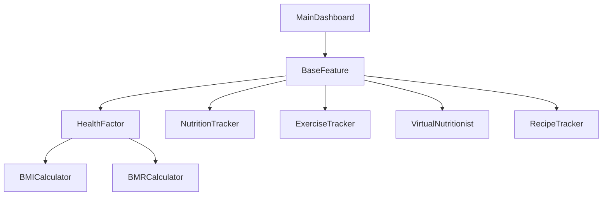

# 🍏 FlavourFit - Health & Fitness Console App

*A Java-based health companion following SOLID principles to deliver personalized wellness recommendations*


## 🌟 Features
```java
1. 📊 Health Metrics (BMI/BMR Calculator)
2. 🥗 Smart Recipe Recommendations 
3. 💪 Exercise Suggestions by Body Part
4. 🤖 Virtual Nutritionist (AI-style tips)
5. 📈 Nutrition & Exercise Tracker
```

## 🏗️ Architecture


## 🛠️ Tech Stack
- **Core**: Java 17
- **OOP**: Inheritance, Composition, Interfaces
- **SOLID**: Strict adherence to all 5 principles
- **Persistence**: File-based data storage

## 🚀 Getting Started
```bash
git clone https://github.com/yourusername/flavourfit.git
cd flavourfit
javac Main.java
java Main
```

## 📜 UML Diagram


## 🤝 Contributing
PRs welcome! Please:
1. Fork the repository
2. Create your feature branch
3. Commit with descriptive messages
4. Push to the branch
5. Open a PR

## 📄 License
MIT © 2024 Afrin Jahan Era

```

