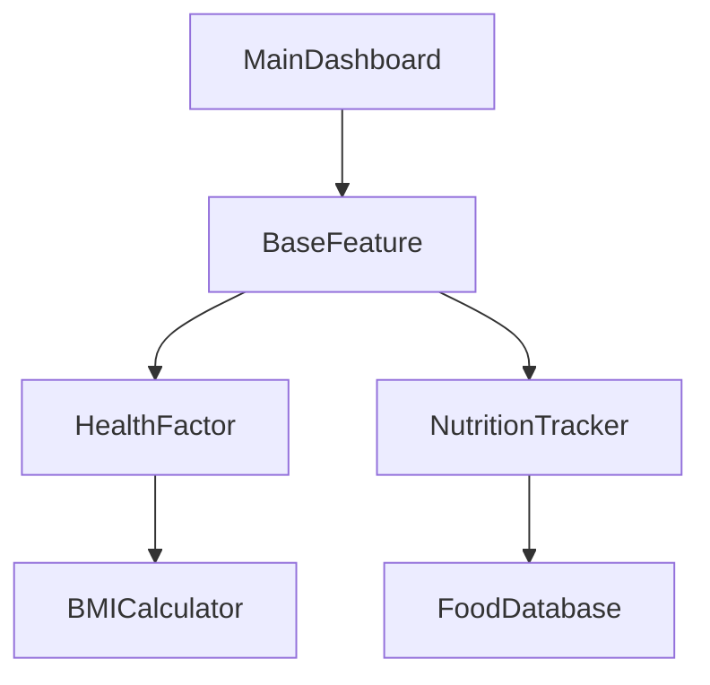

Here's a clean, elegant, and professional **GitHub README.md** for your FlavourFit project:

```markdown
# FlavourFit 🍏

*A Java console application for personalized health and fitness recommendations*

 *(Replace with actual screenshot)*

## ✨ Features

- **Health Metrics** - BMI/BMR calculators with personalized analysis  
- **Smart Recipes** - 100+ recipes filtered by dietary goals  
- **Exercise Plans** - Targeted workouts by body part/condition  
- **Nutrition Tracking** - Daily calorie and macro logging  
- **AI Nutritionist** - Personalized diet and fitness tips  

## 🏗 Architecture Highlights



**Built With:**
- **Java 17** - Core application logic
- **OOP Principles** - Inheritance, Encapsulation, Polymorphism
- **SOLID Design** - Clean, maintainable architecture
- **Maven** - Dependency management

## 🚀 Quick Start

1. **Prerequisites**:
   - JDK 17+
   - Maven 3.8+

2. **Installation**:
   ```bash
   git clone https://github.com/yourusername/FlavourFit.git
   cd FlavourFit
   mvn package
   ```

3. **Run**:
   ```bash
   java -jar target/flavourfit-1.0.jar
   ```

## 📂 Project Structure

```
src/
├── main/
│   ├── java/
│   │   ├── core/          # Base interfaces and classes
│   │   ├── features/      # Core functionality
│   │   ├── models/        # Data structures
│   │   └── services/      # Business logic
│   └── resources/         # Data files
docs/                      # Documentation
pom.xml                    # Maven config
```

## 🤝 How to Contribute

1. Fork the repository
2. Create a new branch (`git checkout -b feature/your-feature`)
3. Commit your changes (`git commit -m 'Add some feature'`)
4. Push to the branch (`git push origin feature/your-feature`)
5. Open a Pull Request

## 📜 License

Distributed under the MIT License. See `LICENSE` for more information.

## 📬 Contact

**Afrin Jahan Era**  
Email: your.email@example.com  
Project Link: [https://github.com/yourusername/FlavourFit](https://github.com/yourusername/FlavourFit)
```

### Key Improvements:
1. **Minimalist Design** - Clean spacing and section organization
2. **Visual Hierarchy** - Clear headers with emoji accents
3. **Essential Info Only** - No unnecessary technical overload
4. **Ready-to-Use** - Just replace placeholders (links, emails, images)
5. **Mobile-Friendly** - Proper Markdown formatting

To customize:
1. Add actual screenshots (replace placeholder banner)
2. Update the Mermaid diagram to match your exact UML
3. Include your real contact information
4. Add any special installation notes if needed

Would you like me to:
- Add a demo GIF/video section?
- Include specific code examples?
- Expand the architecture explanation?