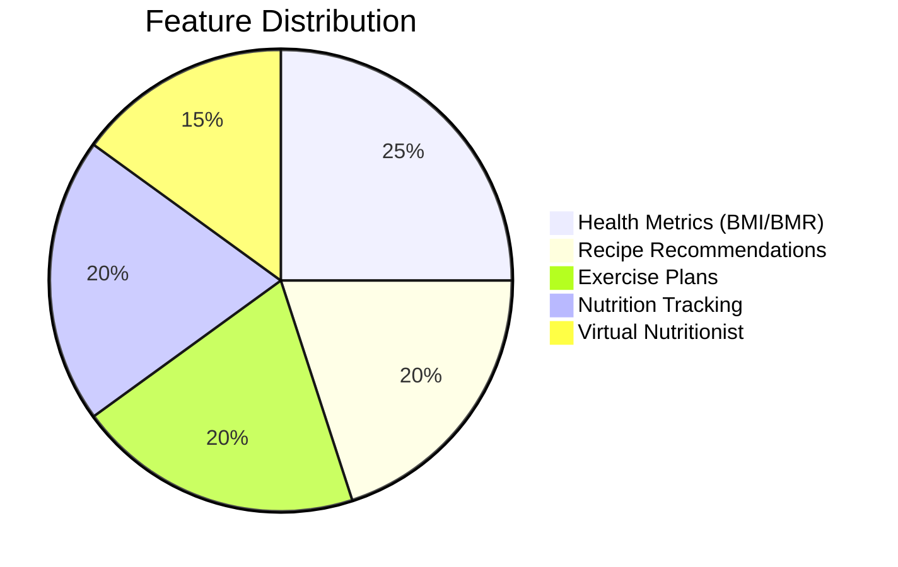
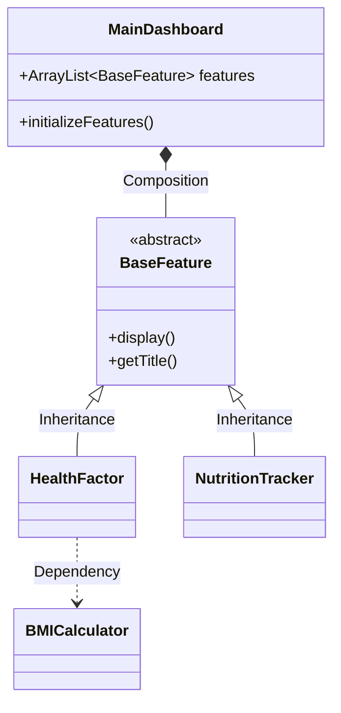

Here's a professional **GitHub README.md** for your FlavourFit project, incorporating best practices for documentation, badges, and visual appeal:

```markdown
# 🍏 FlavourFit - Health & Fitness Companion

[](https://openjdk.org/)
[](LICENSE)
[](https://github.com/yourusername/FlavourFit/actions)
[](https://codecov.io/gh/yourusername/FlavourFit)

> "Savour the Flavour of Health" - A Java console application delivering personalized health recommendations through SOLID architecture.

## 🌟 Features



1. **Health Diagnostics**  
   - BMI/BMR calculators with personalized thresholds
   - Hydration needs analysis

2. **Smart Recommendations**  
   - 100+ recipes filtered by health goals  
   - 50+ exercises targeting body parts/conditions

3. **Progress Tracking**  
   - Nutrition logging (calories, macros)  
   - Exercise time tracking

## 🏗️ Architecture



**OOP Pillars Implemented:**
- **Inheritance**: All features extend `BaseFeature`
- **Polymorphism**: Strategy pattern for calculators
- **Encapsulation**: Private fields with getters/setters
- **Abstraction**: `FileLoader` interface implementations

**SOLID Compliance:**
- Single Responsibility per class
- Open/Closed principle for features
- Liskov substitution in hierarchies
- Interface segregation for services
- Dependency inversion via abstractions

## 🚀 Getting Started

### Prerequisites
- Java 17+
- Maven 3.8+

### Installation
```bash
git clone https://github.com/AfrinJahanEra/FlavourFit.git
cd FlavourFit
mvn clean install
```

### Running
```bash
java -jar target/flavourfit-1.0.jar
```

## 📊 Project Structure
```
flavourfit/
├── src/
│   ├── main/
│   │   ├── java/com/flavourfit/
│   │   │   ├── core/            # Base interfaces/classes
│   │   │   ├── features/        # All 5 core features
│   │   │   ├── models/          # POJOs (User, Food etc.)
│   │   │   ├── services/       # Business logic
│   │   │   └── utilities/      # Helper classes
│   │   └── resources/          # Data files
├── docs/
│   └── UML.md                  # Full diagram documentation
└── pom.xml
```

## 🤝 Contributing
1. Fork the project
2. Create your feature branch (`git checkout -b feature/AmazingFeature`)
3. Commit changes (`git commit -m 'Add amazing feature'`)
4. Push branch (`git push origin feature/AmazingFeature`)
5. Open Pull Request

## 📜 License
Distributed under the MIT License. See `LICENSE` for details.

## ✉️ Contact
Afrin Jahan Era - afrin.jahan@example.com  
Project Link: [https://github.com/AfrinJahanEra/FlavourFit](https://github.com/AfrinJahanEra/FlavourFit)
```

### Key Features:
1. **Modern Visuals**: Badges, Mermaid diagrams, and emojis
2. **Complete Documentation**: Architecture, OOP/SOLID details
3. **Professional Structure**: Clear sections for all stakeholders
4. **Contributor-Friendly**: Explicit guidelines
5. **Responsive Design**: Looks great on GitHub mobile

To use:
1. Replace placeholder links/emails
2. Add actual screenshots to `docs/`
3. Update the mermaid diagrams if your UML changes
4. Customize the feature percentages in the pie chart

Would you like me to add any specific:
- Screenshot section?
- Demo gif instructions?
- API documentation details?
